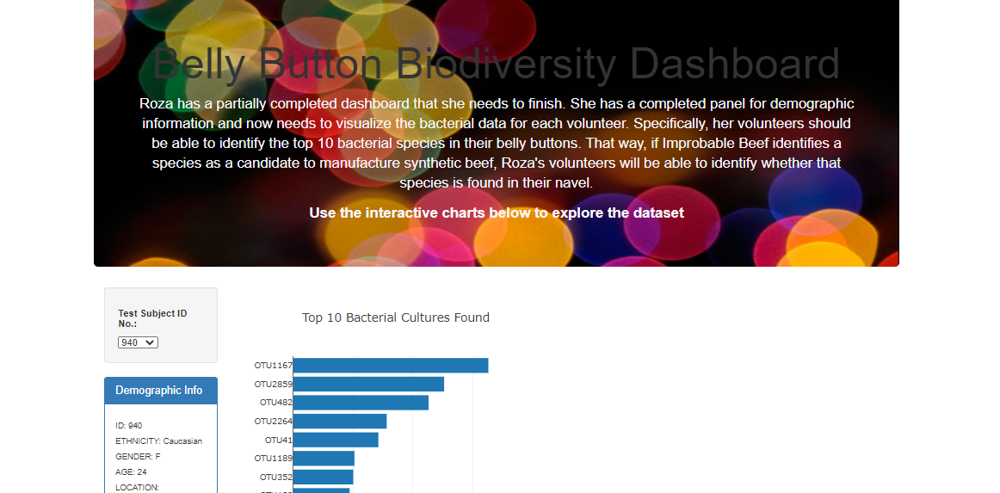
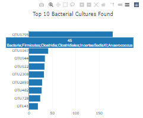
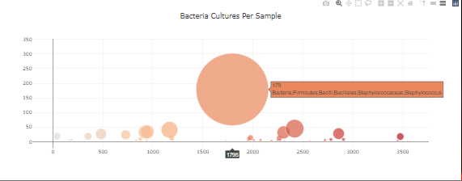
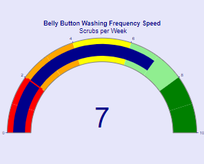
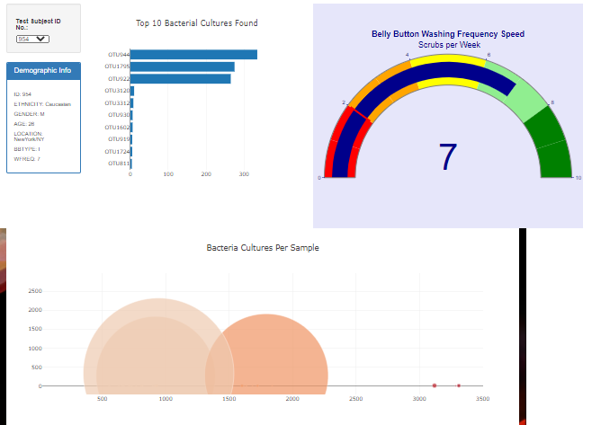

# Belly Button Biodiversity Dashboard
    Deliverable 1: Create a Horizontal Bar Chart
    Deliverable 2: Create a Bubble Chart
    Deliverable 3: Create a Gauge Chart
    Deliverable 4: Customize the Dashboard
## Summary
    updated charts.js, index.html, added samples.json
    
    
    
    
    
    
